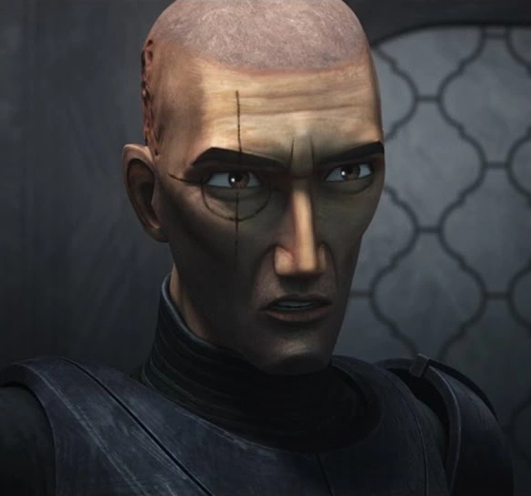

# Crosshair

CT-9904, nicknamed "Crosshair," was a clone commando who served in the Grand Army of the Republic during the Clone Wars as part of Clone Force 99. Crosshair possessed genetic mutations that gave him exceptional eyesight and because of it, he acted as a sniper, taking advantage of his marksmanship skills.

