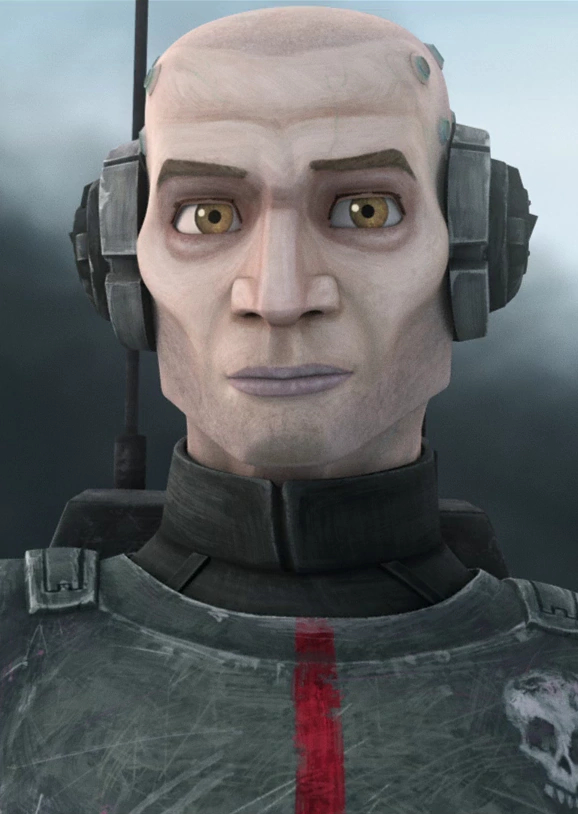

# Echo

Echo, originally designated CT-1409 and known as the Hero of Anaxes, was a clone trooper and Corporal who served the Grand Army of the Galactic Republic during the Clone Wars. Born on Kamino, Echo was originally identified as CT-21-0408, a cadet of the Domino Squad along with his friends, CT-782 "Hevy," CT-4040 "Cutup," CT-00-2010 "Droidbait," and CT-5555 "Fives," before he graduated from the clone training center. On his first assignment after graduating, Echo was tasked with guarding the Rishi Station moon base, where he, along with Fives, Clone Captain Rex, Clone Commander CC-2224 "Cody," and Hevy, who sacrificed himself during the fight, aided in warning the Republic of an impending Separatist attack on Kamino. Echo was commended for his bravery and absorbed into the 501st Legion.

