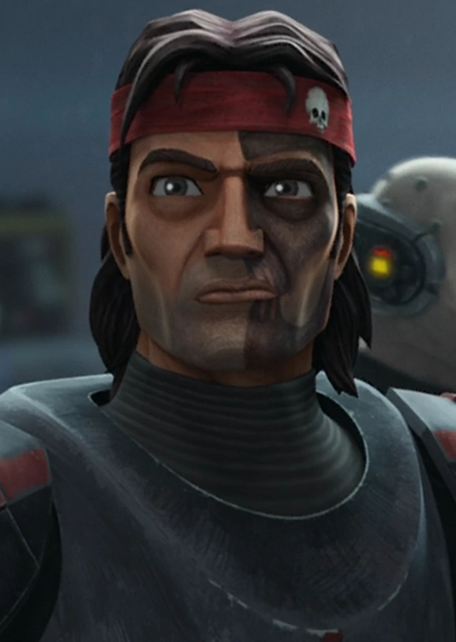

# Hunter

"Hunter" was the nickname of a clone commando sergeant who served as the commanding officer of Clone Force 99 in the Grand Army of the Republic during the Clone Wars, fought between the Galactic Republic and the Confederacy of Independent Systems. He was genetically altered to have heightened senses and commanded his comrades who had their own unique mutations, in what they called the "Bad Batch." Other members of the squad included Wrecker, Tech, and Crosshair, and later, Echo.

