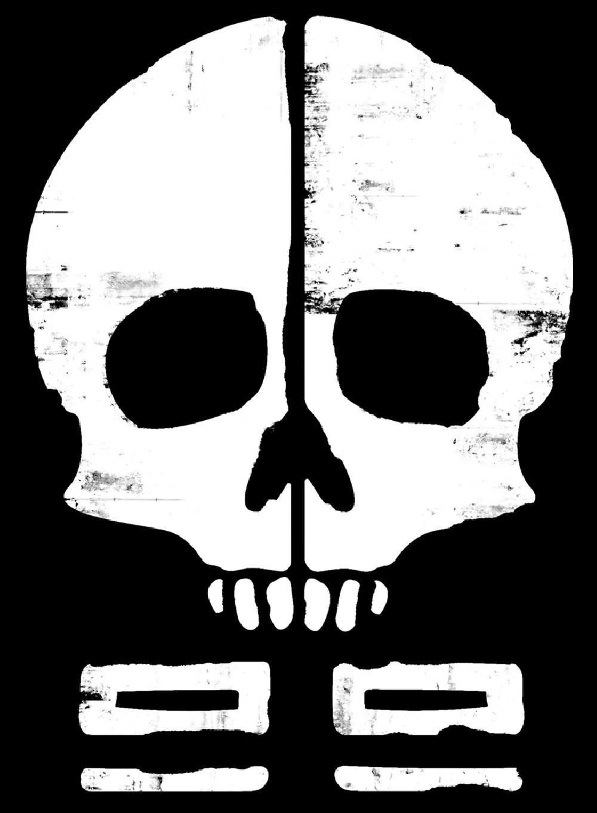

# Clone Force 99

{: style="height:136px;width:100px" }

## Summary

Clone Force 99, unofficially known as the "Bad Batch" and designated as Experimental Unit Clone Force 99, was a clone commando special forces squad that was active during the Clone Wars. The squad initially consisted of four clone commandos that were designed with genetic mutations and led by Clone Sergeant "Hunter," a clone with enhanced sensory abilities. Other members of the squad included CT-9904 "Crosshair," a clone with keen eyesight and marksmanship that allowed him to excel in long-distance firefights, "Wrecker," a reckless clone with enhanced muscular form, and "Tech," a clone with enhanced mental capacity and intelligence. Following the crucial Battle of Anaxes, Advanced Recon Commando Clone Corporal CT-1409 "Echo" joined the unit. 

## Squad

- [Hunter](hunter.md)
- [Echo](echo.md)
- [Tech](tech.md)
- [Wrecker](wrecker.md)
- [Crosshair](crosshair.md)

