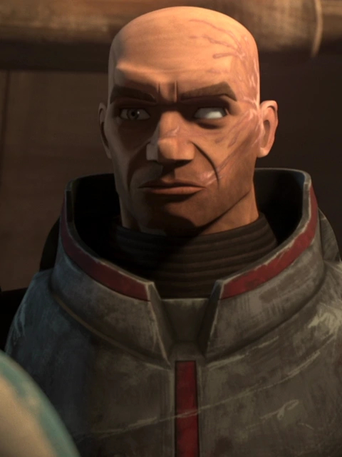

# Wrecker

"Wrecker" was a clone commando who served in the Grand Army of the Republic during the Clone Wars as part of Clone Force 99. Due to genetic mutations, Wrecker was much larger and stronger than the average clone trooper. He loved blowing things up, and served as the muscle and demolitions expert for his squad.

